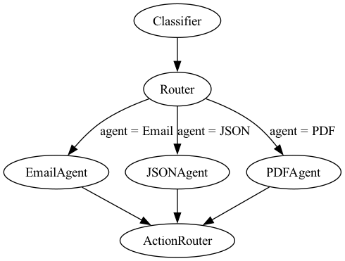

# Multi-Format Autonomous AI System

## Table of Contents
1. [Overview](#overview)
2. [Architecture & Flow](#architecture--flow)
3. [Prerequisites](#prerequisites)
4. [Installation](#installation)
5. [Configuration & Environment Variables](#configuration--environment-variables)
6. [Running the System](#running-the-system)
    - [Running the Workflow Script Locally](#running-the-workflow-script-locally)
    - [Running the Streamlit UI Locally](#running-the-streamlit-ui-locally)
    - [In Docker (Optional)](#running-in-docker-optional)
7. [Sample Inputs & Expected Outputs](#sample-inputs--expected-outputs)
8. [Troubleshooting](#troubleshooting)
9. [Contributing](#contributing)

## Overview
This project implements a multi-format autonomous AI system using LangGraph and Google Gemini models. It's designed to receive raw text input, classify its format (Email, JSON, PDF) and business intent, route it to a specialized agent for processing, and then determine an appropriate action based on the agent's output. The system logs its operations, optionally using Redis for persistent memory.

A Streamlit web application is also provided for a user-friendly interface to trigger workflows, upload files, input data, and monitor real-time logs and output.

## Architecture & Flow
The system is built as a directed acyclic graph (DAG) using LangGraph. The main components and flow are as follows:

1.  **Classifier**: Receives the raw input text. It uses a Gemini LLM to determine the `format` (Email, JSON, PDF) and the `intent` (e.g., RFQ, Complaint, Invoice, Regulation, Fraud Risk) of the input.
2.  **Router**: Takes the `format` from the Classifier and conditionally routes the input payload to the appropriate specialized agent (EmailAgent, JSONAgent, or PDFAgent).
3.  **Specialized Agents**:
    * **EmailAgent**: Processes email content. It extracts fields like sender, urgency, and issue summary, identifies tone, flags potential spam/phishing, and suggests a primary action (e.g., ESCALATE, ACKNOWLEDGE, ROUTINE).
    * **JSONAgent**: Parses and validates JSON payloads against a defined schema. It checks for schema validity, deprecated versions, and unknown event types, outputting a validation status and any errors or warnings.
    * **PDFAgent**: Processes text extracted from PDF documents. It determines if the PDF is an INVOICE or a POLICY document, extracts relevant fields (e.g., invoice details, policy terms), and sets flags (e.g., HIGH_VALUE_INVOICE, COMPLIANCE_RISK). The PDFAgent dynamically uses the current date for some evaluations (e.g., PAST_DUE_INVOICE).
4.  **ActionRouter**: Receives the output from the specialized agent. Based on the agent's name and its structured output, this component determines and logs a final business action to be taken (e.g., post to an alert system, forward to a team, log and close).

All significant steps and data points during an orchestration run are logged to the console and, if Redis is configured and available, to a Redis-based memory store for later inspection. The Streamlit UI fetches these logs directly from Redis.

The visual representation of this architecture is:

*(This diagram can be generated by running `architecture.py`)*

## Prerequisites
* Python (3.9 or higher recommended)
* pip (Python package installer)
* **Redis** (Mandatory for persistent memory logging and for the Streamlit UI to display logs. If not running, the system will print connection errors, and the UI's log display will not function.)
* Graphviz (Optional, if you want to generate the architecture diagram using `architecture.py`)
* Access to Google Gemini API and a valid API key.

## Installation
1.  **Clone the repository (if applicable)**:
    ```bash
    # git clone <repository-url>
    # cd <repository-directory>
    ```

2.  **Create and activate a Python virtual environment**:
    ```bash
    python -m venv venv
    source venv/bin/activate  # On Windows: venv\Scripts\activate
    ```

3.  **Install dependencies**:
    Your `requirements.txt` file should contain the necessary dependencies. Ensure it includes:
    ```txt
    langgraph
    langchain-google-genai
    redis
    python-dotenv
    streamlit
    Faker # For generating fake data in the UI
    # graphviz # Optional, if generating diagrams
    # ipython # Optional, for interactive display in architecture.py
    # tika # If you plan to parse real PDFs (note: Tika requires Java)
    ```
    Then run:
    ```bash
    pip install -r requirements.txt
    ```

4.  **Install Redis Server Locally**:
    To enable logging and full functionality of the Streamlit UI, you **must** have a Redis server running locally.
    * **macOS (using Homebrew):**
        ```bash
        brew install redis
        brew services start redis
        ```
    * **Linux (Debian/Ubuntu):**
        ```bash
        sudo apt update
        sudo apt install redis-server
        sudo systemctl start redis-server
        sudo systemctl enable redis-server
        ```
    * **Windows (Recommended: WSL 2 or Docker):**
        * **WSL 2:** Install a Linux distribution via WSL 2, then follow the Linux instructions inside WSL.
        * **Docker:** If you have Docker Desktop installed:
            ```bash
            docker run --name some-redis -p 6379:6379 -d redis
            ```
    * **Verify Redis:** Open a new terminal and run `redis-cli ping`. You should see `PONG`.

## Configuration & Environment Variables

1.  **Google API Key**:
    The system requires a Google API key for the Gemini models used by the agents.
    * Create a file named `.env` in the root project directory.
    * Add your API key to the `.env` file:
        ```env
        GEMINI_KEY="YOUR_GOOGLE_API_KEY_HERE"
        ```
    The agent files (`core_Agents/*.py`) load this key using `python-dotenv`.

2.  **Redis Configuration**:
    Both `langGraphRun.py` and `streamlit_app.py` attempt to connect to a Redis instance by default at `localhost:6379`.
    * If your Redis server runs on a different host or port, or requires a password, modify the connection parameters in both `langGraphRun.py` and `streamlit_app.py` (look for `redis.Redis(...)` lines).
        ```python
        redis_client = redis.Redis(host='YOUR_REDIS_HOST', port=YOUR_REDIS_PORT, db=0, decode_responses=True #, password='YOUR_REDIS_PASSWORD'
        )
        ```
    * If Redis is not available, the scripts will print connection errors, and memory logging/log display in the Streamlit UI will not function.

## Running the System

You have two primary ways to run the system:
1.  **Running the workflow script directly (`langGraphRun.py`)**: For command-line execution and testing the core logic.
2.  **Running the Streamlit UI (`streamlit_app.py`)**: For an interactive web interface with input options and live log display.

### Running the Workflow Script Locally

This method executes the `langGraphRun.py` script directly, running the predefined examples.

1.  **Set up Environment Variables**: Ensure your `.env` file is correctly configured with your `GEMINI_KEY`.
2.  **Start Redis**: Ensure your Redis server is running and accessible as described in [Installation](#installation).
3.  **Run the Orchestration Script**:
    From the project's root directory, execute:
    ```bash
    python langGraphRun.py
    ```
    You will see logs printed to the console showing the flow of data through the graph, including classification, routing, agent processing, and final actions. Memory logs will be saved to Redis.

### Running the Streamlit UI Locally

This method provides an interactive web interface for your AI system.

1.  **Set up Environment Variables**: Ensure your `.env` file is correctly configured with your `GEMINI_KEY`.
2.  **Start Redis**: **Crucially**, ensure your Redis server is running and accessible as described in [Installation](#installation). The Streamlit UI *requires* Redis for log display.
3.  **Open a NEW terminal window**: Do not use the terminal where you started Redis (if you started it in the foreground).
4.  **Navigate to your project directory**:
    ```bash
    cd /path/to/your/multi Agent system/orchestration
    ```
    (Replace `/path/to/your/` with the actual path to your project.)
5.  **Run the Streamlit application**:
    ```bash
    streamlit run streamlit_app.py
    ```
    This command will open a new tab in your default web browser (usually at `http://localhost:8501`) displaying the Streamlit application. You can then use the UI to paste raw input, upload files, trigger the workflow, and monitor the logs fetched from Redis.

### Running in Docker (Optional)
*(Instructions for Docker setup would go here. This would typically involve creating a `Dockerfile` and potentially a `docker-compose.yml` file if Redis is also to be containerized.)*

Currently, Docker setup is not provided.

## Sample Inputs & Expected Outputs
The `langGraphRun.py` script includes a list of sample inputs in the `examples` variable within its `if __name__ == "__main__":` block. These examples cover various scenarios for emails, JSON, and PDF-like text.

When you run the script (either directly or via the Streamlit UI), the expected output for each example will be:
* Console logs indicating the start of an orchestration with a unique ID.
* The input data snippet being processed.
* Logs from each step in the graph:
    * `[MEMORY_REDIS]` messages showing data being written to memory.
    * Classification results (format and intent).
    * Routing decisions.
    * Outputs from the specialized agents (EmailAgent, JSONAgent, PDFAgent).
    * `[ACTION]` logs detailing the final triggered action based on the `action_router` logic.
* A message indicating the completion of the orchestration and the final state of the graph.
* If Redis is connected, a full log retrieved from Redis for the orchestration run will be printed in the console and displayed in the Streamlit UI.

For instance, for a phishing email:
* Classifier might output: `Email|Fraud Risk`
* Router directs to EmailAgent.
* EmailAgent might output JSON with `"spam_flag": "PHISHING_RISK"` and `"action": "ESCALATE"`.
* ActionRouter logs an action like: `POST /alerts/email_phishing with details...` (depending on the specific rules in `action_router`).

## Troubleshooting

* **`Bad message format 'setIn' cannot be called on an ElementNode always` Alert in Streamlit:**
    * **Problem:** This is a frontend rendering issue within Streamlit, often related to browser cache or specific UI interactions.
    * **Solution:**
        1.  **Clear your browser's cache and cookies** for `localhost:8501` (or whatever port Streamlit is running on). A hard refresh (`Ctrl + Shift + R` or `Cmd + Shift + R`) might also help.
        2.  **Try a different web browser.**
        3.  **Restart the Streamlit server:** Go to the terminal where `streamlit run` is active, press `Ctrl + C` to stop it, then re-run `streamlit run streamlit_app.py`. Also, close and reopen your browser.
        4.  **Update Streamlit:** `pip install --upgrade streamlit`.
        5.  If you are using the "Generate Fake JSON Data" button, try inputting data manually instead to see if the issue is with the generated data structure or its display.

* **`API key expired` Error**:
    * **Problem**: The Google API key (`GEMINI_KEY` in your `.env` file) is no longer valid.
    * **Solution**: Generate a new API key from the Google Cloud Console or Google AI Studio and update it in your `.env` file.

* **`Could not connect to Redis` Error**:
    * **Problem**: The script cannot connect to the Redis server at the configured address (`localhost:6379` by default).
    * **Solution**:
        * **Ensure your Redis server is running.** Use `redis-cli ping` in a terminal to verify.
        * Verify the host and port in `langGraphRun.py` and `streamlit_app.py` match your Redis server configuration.
        * If Redis is not running, the Streamlit UI's log display functionality will not work.

* **Python Environment Issues / Module Not Found**:
    * **Problem**: Python cannot find the installed packages.
    * **Solution**:
        * Ensure you have activated your virtual environment (`source venv/bin/activate`).
        * Verify all dependencies from `requirements.txt` are installed in the active environment.

* **Incorrect Agent Behavior or Output**:
    * **Problem**: Agents are not extracting information correctly or the `action_router` is not triggering the expected actions.
    * **Solution**:
        * Review the prompts in the respective agent files (`core_Agents/*.py`). Prompt engineering is key to LLM behavior.
        * Check the logic within the `action_router` function in `langGraphRun.py` to ensure it correctly handles the outputs from the agents.
        * Examine the detailed memory logs (if Redis is enabled) or console output for the intermediate data passed between nodes to pinpoint where the process deviates.

## Contributing
Contributions are welcome! Please follow these general guidelines:
1.  Fork the repository.
2.  Create a new branch for your feature or bug fix.
3.  Make your changes.
4.  Ensure your code follows the existing style and includes relevant tests (if applicable).
5.  Update documentation (like this README) if you make changes to the architecture, setup, or usage.
6.  Submit a pull request with a clear description of your changes.
